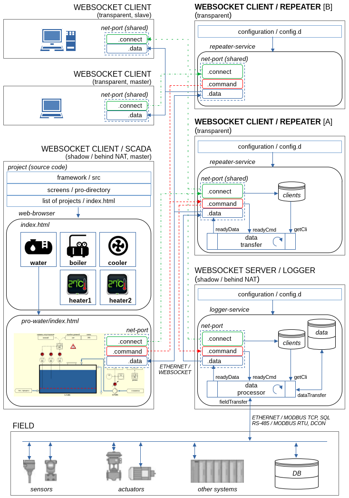

# WebSocket Server / Repeater

- Configuration (examples)
- Documentation
- Source code

### Hardware Platform

- PC, Server, Laptop
  - processor architectures
    - x86, x64, ARMv6, ARMv7, ...
  - interfaces
    - Ethernet/LAN or WiFi

### Software Platform

- Framework / Language
  - Qt5 / C++11
- OS
  - Windows
  - Linux
- Network-protocols
  - WebSocket
- Data format
  - JSON
- Multithreading
